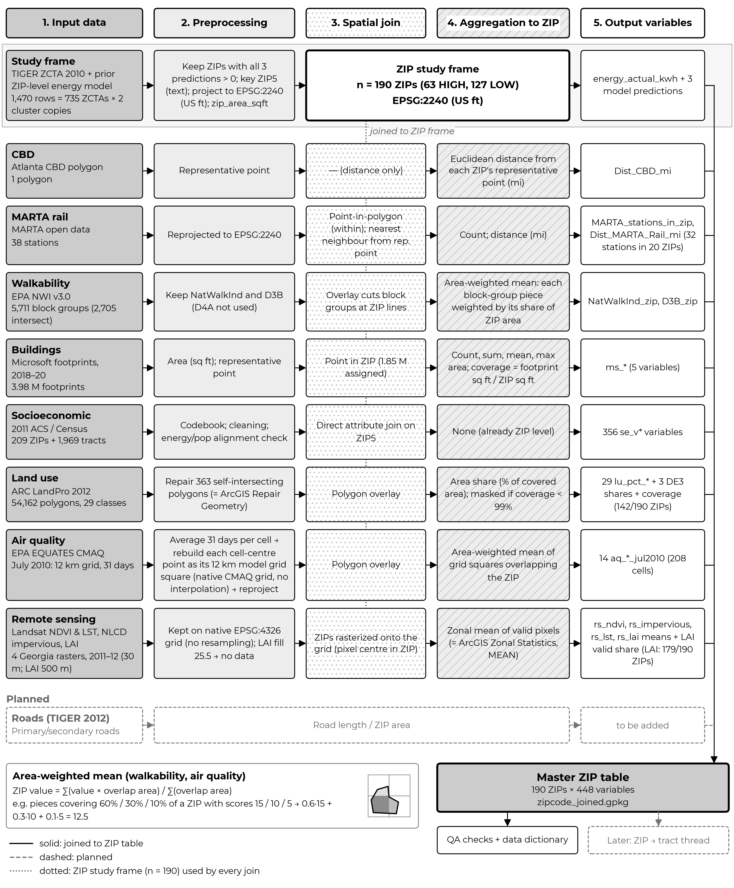

# Atlanta Metro Energy & Urban Morphology

A research data pipeline for the Atlanta Metro Region. It combines residential energy use with urban
form, transit access, walkability, building footprints and socioeconomic variables, and it tests
whether a prior ZIP-level energy model (Random Forest and MATLAB regression) stays spatially
consistent when aggregated from ZIP Code to Census Tract level.

## Status

- **ZIP-level data preparation: done.** [`notebooks/01_data_preparation.ipynb`](notebooks/01_data_preparation.ipynb)
  builds the 190-ZIP master table. Each data source has its own section with its method, EDA,
  sanity checks and maps:
  - distance to the CBD
  - MARTA rail access
  - EPA walkability
  - Microsoft building footprints
  - 2011 ACS/Census socioeconomic variables
  - ARC LandPro 2012 land use
  - EPA EQUATES CMAQ air quality (July 2010)
  - remote-sensing rasters (NDVI, impervious surface, land surface temperature, leaf area index):
    zonal mean per ZIP
- **Pending:**
  - roads
  - the tract-level thread
- **Dropped from scope:** MARTA bus, NLCD tree canopy.

## Workflow



Vector version for print: [`figures/workflow_paper.pdf`](figures/workflow_paper.pdf). A simplified
16:9 version for slides: [`figures/workflow_slide.png`](figures/workflow_slide.png). Both figures are drawn by
[`scripts/make_workflow_diagrams.py`](scripts/make_workflow_diagrams.py); run it from the repo root to
regenerate them after adding data.

## How to reproduce

The ZIP-level master table (`data/interim/zipcode_joined.gpkg`, 190 ZIPs) and its data dictionary
(`data/processed/zipcode_data_dictionary.csv`) are committed, with a CSV and Excel copy of the table
without geometry (`data/processed/zipcode_master.csv`, `.xlsx`). The other input data is not in the repository:
`data/` is otherwise gitignored, and some inputs are study data that is not redistributed. See the **"Reproducing this notebook"** cell at the top of
`notebooks/01_data_preparation.ipynb` for:
- the environment setup (`pip install -r requirements.txt`, with pinned versions);
- the list of raw input files, their expected paths and their sources;
- the `nbconvert` command that runs the notebook end to end.

## Repo layout

```
data/            # gitignored, except the master table and data dictionary
├── raw/         # inputs, never modified (vectors/, rasters/, tables/)
├── interim/     # CRS-standardised layers, base and joined ZIP tables, codebook
└── processed/   # final outputs (data dictionary)
notebooks/       # 01_data_preparation.ipynb
docs/            # project background and ArcGIS methodology
tests/           # (placeholder)
```

## Project docs

- [`docs/atlanta_methodology_arcgis.md`](docs/atlanta_methodology_arcgis.md): the step-by-step ArcGIS
  methodology that this pipeline reproduces, including the problems encountered and how they were
  fixed.

Join keys are always text: `ZIP5` (5 characters) and `TractGeoID` (11 characters, zero-padded).
